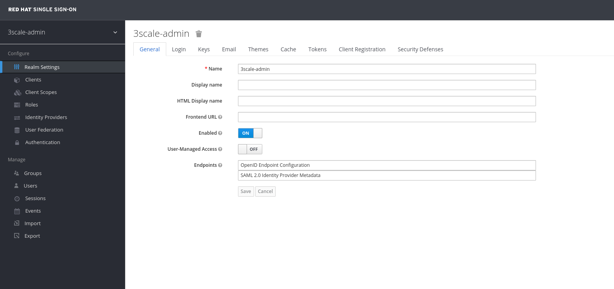

# Workshop integrando o Red Hat Single Sign-On e 3Scale

Demonstração de como integrar o 3scale com o Red Hat Single Sign-On (RH-SSO) e posteriormente expor APIS através do 3scale adicionando um camada de segurança.

O Red Hat Single Sign-On (RH-SSO) é uma solução de Sign-On integrada (SSO) que, quando usada em conjunto com 3scale, permite que você autentique seus desenvolvedores usando qualquer uma das opções de identity brokering e user federation.

## Pré-requisitos

Este workshop tem como pré requisito a instalação e configuração de uma instancia do Red Hat Single Sign-ON e do 3scale. As instruções podem ser encontradas no portal Red Hat (https://access.redhat.com/documentation/en-us/).

## Laboratórios:

0. [Configurando o Red Hat Single Sign-ON (RH-SSO)] (#testdrive-step-0)
1. [Criando um realm] (#testdrive-step-1)
2. [Adicionando um novo Client] (#testdrive-step-2)
3. [Criando uma API Rest no Fuse Online utilizando API First Approach](#testdrive-step-3)
4. [Utilizando Conditional Flows](#testdrive-step-4)
4. [SoapToRest](https://developers.redhat.com/blog/2018/07/24/migrate-soap-to-rest-with-camel/)
5. [API First](https://developers.redhat.com/blog/2018/07/12/contract-first-api-design-with-apicurio-and-red-hat-fuse/)

### Configurando o Red Hat Single Sign-ON (RH-SSO). 

Neste primeiro passo iremos configurar o Red Hat Single Sign-ON (RH-SSO) seguindo a [documentação do produto](https://access.redhat.com/documentation/en-us/red_hat_3scale_api_management/2.9/html-single/creating_the_developer_portal/index#enabling_and_disabling_authentication_via_red_hat_single_sign_on).

### Criando um realm. 

Após realizar o login na console de administração do RH-SSO, posicione o mouse abaixo de **Master** (lado esquerdo acima) e clique em **Add realm**.
Informe o nome do realm **3scale-admin**

Do lado esquerdo acima, estará o nome do realm criado conforme imagem abaixo:

### Adicionando um novo Client. 

Agora iremos adicionar um novo client no realm **3scale-admin** que criamos anteriormente.

Vá até a opção **Clients** e clique em **Create**.

Informe o **Client ID**, no nosso caso será o **3scale** e clique em **Save**.

Agora iremos configurar os parâmetros deste **Client** seguindo os parâmetros abaixo:

**Client ID:** informe o nome desejado, no nosso caso será **3scale-rh-sso**.
**Enabled:** mude para **ON**.
**Consent Required:** mude para **OFF**.
**Client Protocol:** selecione **openid-connect**.
**Access Type:** selecione **confidential**.
**Standard Flow Enabled:** mude para **ON**.
**Root URL:** Informe a URL da console de administração do 3scale https://yourdomain.3scale.net.
**Valid Redirect URLs:** Informe o endereço da console de administração do 3scale e adicione: **/*** por exemplo: https://yourdomain.3scale.net/*.

TODOS os demais parâmetros devem ser mudados para **OFF**.

