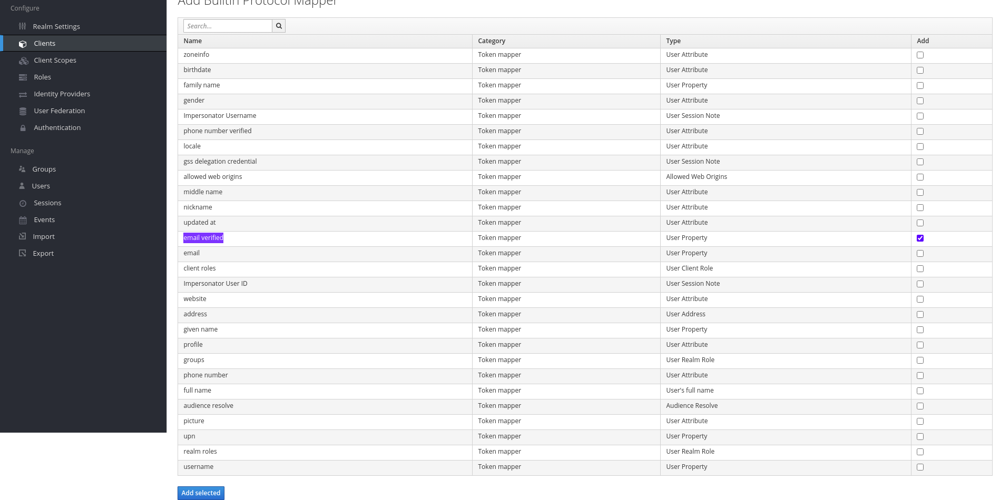
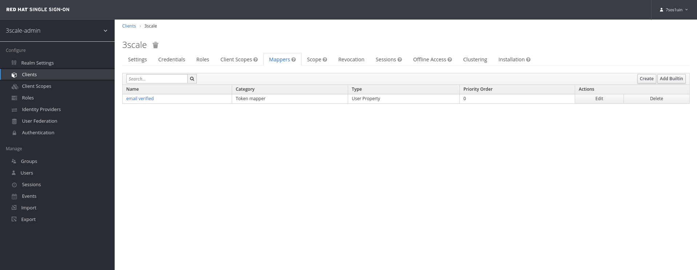
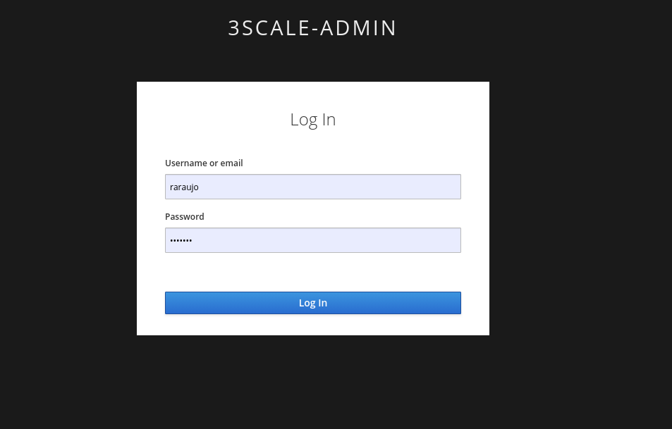
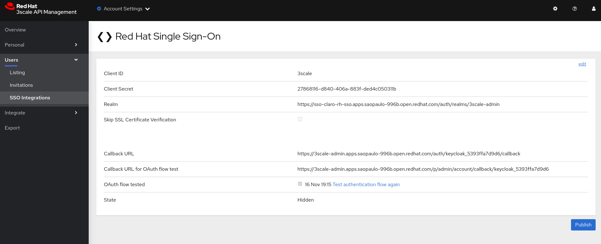
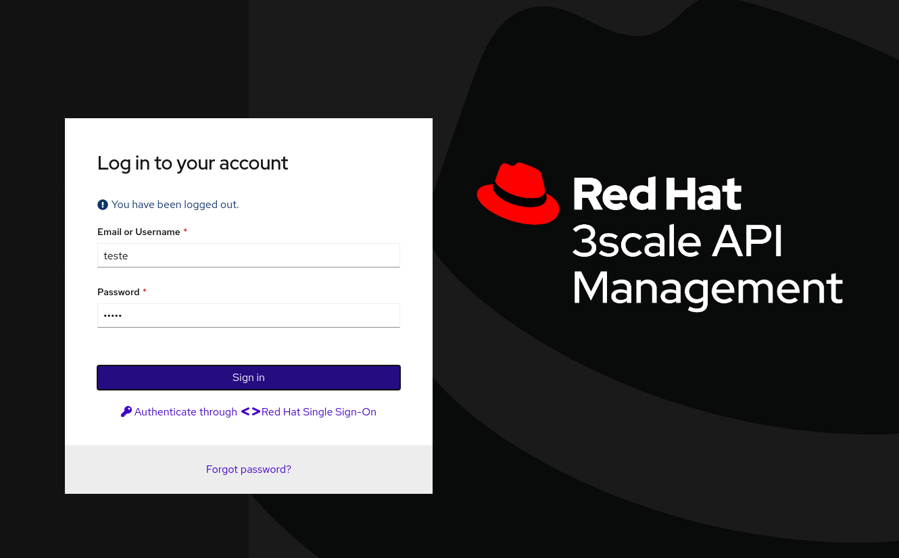

# Integrando o Red Hat Single Sign-On com o 3Scale

Demonstração de como integrar o 3scale com o Red Hat Single Sign-On (RH-SSO) e posteriormente expor APIS através do 3scale adicionando um camada de segurança.

O Red Hat Single Sign-On (RH-SSO) é uma solução de Sign-On integrada (SSO) que, quando usada em conjunto com 3scale, permite que você autentique seus desenvolvedores usando qualquer uma das opções de identity brokering e user federation.

## Pré-requisitos

Este workshop tem como pré requisito a instalação e configuração de uma instancia do Red Hat Single Sign-ON e do 3scale. As instruções podem ser encontradas no portal Red Hat (https://access.redhat.com/documentation/en-us/).

## Integrando console de administração do 3scale com o Red Hat Single Sign-On (RH-SSO):

0. [Configurando o Red Hat Single Sign-ON (RH-SSO)](#testdrive-step-0)
1. [Criando um realm](#testdrive-step-1)
2. [Adicionando um novo Client](#testdrive-step-2)
3. [Integrando 3scale Admin Console com RH-SSO](#testdrive-step-3)

## Expondo APIs através do 3scale e integrando com o Red Red Single Sign-ON (RH-SSO):

0. [Introdução.](#testdrive-step-4)
1. [Criando um Realm no RH-SSO.](#testdrive-step-5)

### Configurando o Red Hat Single Sign-ON (RH-SSO). 

Neste primeiro passo iremos configurar o Red Hat Single Sign-ON (RH-SSO) seguindo a [documentação do produto](https://access.redhat.com/documentation/en-us/red_hat_3scale_api_management/2.9/html-single/creating_the_developer_portal/index#enabling_and_disabling_authentication_via_red_hat_single_sign_on).

### Criando um realm. 

Após realizar o login na console de administração do RH-SSO, posicione o mouse abaixo de **Master** (lado esquerdo acima) e clique em **Add realm**.
Informe o nome do realm **3scale-admin**

Do lado esquerdo acima, estará o nome do realm criado conforme imagem abaixo:

### Adicionando um novo Client. 

Adicione um novo client no realm **3scale-admin** que criamos anteriormente.

Vá até a opção **Clients** e clique em **Create**.

Informe o **Client ID**, no nosso caso será o **3scale** e clique em **Save**.

Configure os parâmetros deste **Client** conforme os campos abaixo:

- **Client ID:** informe o nome desejado, no nosso caso será **3scale-rh-sso**.
- **Enabled:** mude para **ON**.
- **Consent Required:** mude para **OFF**.
- **Client Protocol:** selecione **openid-connect**.
- **Access Type:** selecione **confidential**.
- **Standard Flow Enabled:** mude para **ON**.
- **Root URL:** Informe a URL da console de administração do 3scale https://yourdomain.3scale.net.
- **Valid Redirect URLs:** Informe o endereço da console de administração do 3scale e adicione: **/*** por exemplo: https://yourdomain.3scale.net/*.

TODOS os demais parâmetros devem ser mudados para **OFF**.

Vá até a aba **Credentials** e copie o client secret gerado conforme a imagem a seguir:

Posteriormente vá até a aba **Mappers** e clique em **Add Builtin**

Selecione **email verified** e clique em **Add selected**

Certifique-se de ter configurado corretamente conforme imagem a seguir:

### Configurando o 3scale Admin Console. 

Neste primeiro passo iremos integrar a console de administração do 3 scale com o nosso client criado no Red Hat Single Sign-On (RH-SSO).

Após logar na console de administração do 3scale, vá até **Account Settings (*) - Users - SSO Integrations **

Clique em **New SSO Integration** e preencha os campos conforme abaixo:

- **Client:** Nome do client no Red Hat Single Sign-On
- **Client Secret:** Client secret 
- **Realm:** Nome do Realm e URL de acesso para o Red Hat Single Sign-ON

Posteriormente clique em **Create Authentication Provider**

Agora iremos testar nossa integração. Clique em **Test authentication flow now**

Faça o login com um usuário do RH-SSO. 

** Caso você não tenha criado um usuário anteriormente, siga os passos descritos em [**4.2. Creating New Users**](https://access.redhat.com/documentation/en-us/red_hat_3scale_api_management/2.9/html-single/creating_the_developer_portal/index#enabling_and_disabling_authentication_via_red_hat_single_sign_on)

** Caso receba a mensagem de erro: **Your account isn't active or hasn't been approved yet.**, ative a flag **Email Verified** para **ON** nas configurações do seu usuário no RH-SSO.

Após validar o fluxo de autenticação, clique em **Publish** e verifique se o **State** mudou para **Visible**

Pronto, sua console de administração do 3scale está instegrada ao Red Hat Single Sign-On (RH-SSO). Basta clicar em **Authenticate through Red Hat Single Sign-On** que seu login será feito com base nos usuários do RH-SSO.

Após logar com o usuário do RH-SSO, logue novamente na console de administração do 3scale e vá em **Account Settings (*) - Users - Listing**, clique em **Edit** e na seção **Administrative**, aplique a **Role - Admin (full access)** para seu usuário e depois clique em **Update User**, assim poderemos seguir para os próximos passos com todas as permissões aplicadas a este usuário.

### Introdução. 

Nos passos a seguir, iremos confgurar um novo realm no Red Hat Single Sign-On e posteriormente um novo client que serão utilizados pelas APIS que serão expostas no 3 scale. Seguiremos os passos [descritos na documentação](https://access.redhat.com/documentation/en-us/red_hat_3scale_api_management/2.7/html/administering_the_api_gateway/openid-connect).

### Criando um Realm no RH-SSO. 

